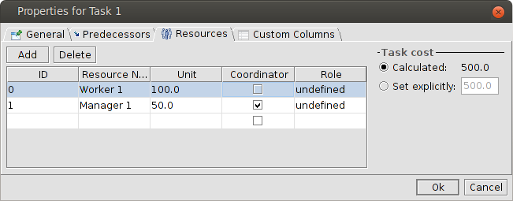
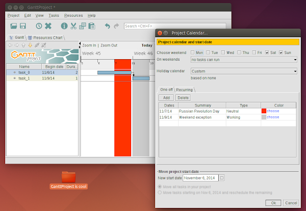

## GanttProject 2.7 Ostrava

GanttProject 2.7 "Ostrava" (which is the third largest city in Czech Republic), is an evolution of
GanttProject 2.5 and 2.6. It adds a few major features, fixes usability problems and bugs.
A short overview of the major changes is given below.

Date           | Release
:------------- | :------------------------------------
07 Feb 2016    | [GanttProject 2.7.2](https://github.com/bardsoftware/ganttproject/releases/tag/ganttproject-2.7.2)
23 July 2015   | [GanttProject 2.7.1](https://github.com/bardsoftware/ganttproject/releases/tag/ganttproject-2.7.1)

## Headlines
### Task cost calculation
This is one of the most requested features in our bugtracker.
What is implemented in GP 2.7 is really simple, but we hope that many of you will find it useful.
We've added Cost property to our tasks model and user interface. It sits in the Resources tab of task properties dialog:

Cost can be calculated automatically, which is the default setting, or typed manually.
When calculated automatically, it is a sum of payment rates of assigned resources, each multiplied by their utilization
and task duration. Naturally, in the resource properties dialog one can specify payment rate for each resource.
At the moment we support standard rate only, with no specific currency, per our default time unit which is day.
So, if you assign 1 resource with standard rate 50 to a task with duration 5 days, its calculated cost will be 250.
If you assign one more resource with standard rate 100 but 50% utilization, the total cost will be 250 + 250 = 500

The cost of a summary task is the sum of subtask costs, but can also be set manually.

### Import holiday calendars in iCalendar format
GanttProject has been using holiday calendars in its own simple format for years, but we understand that it is impossible
to find calendars in this format. However, there are many calendars in iCalendar format published on Mozilla Holiday Calendars
or iCalShare web sites. Now you can import holiday calendars into GanttProject with our new import tool.
It can import `.ics` files, so you'll need to download them or export from other tools. The tool is quite simple and will
just import all events as holidays into current project's calendar. Find it in `Project > Import` menu.

### Weekend exceptions

One more highly requested calendar-related feature is ability to make working some particular weekend day.
For instance, in some countries if a holiday happens on Tuesday, it will be "merged" with the closest weekend, and
Monday will be non-working too (thus we get 4 days looong weekend), but one of the next weekends will have one working
day.

Such use case could not be represented in GanttProject previously. In GP 2.7 it is possible to add "exceptions" and make
particular weekends working. This feature sits in Project Calendar options page which is available via Project▶Properties
menu item.

## Compatibility
We expect that files created in the previous versions of GanttProject should work fine in GP 2.7, and that GanttProject 2.6
can read files created in GP 2.7, skipping data related to newly added features of course.

## System requirements

* Any reasonably modern computer with reasonably modern OS capable of running Java applications is fine for running GanttProject.
Please refer to information from Oracle or from your platform vendor about Java Runtime compatibility with your operating system.
* We recommend using [Java 8](http://www.oracle.com/technetwork/java/javase/downloads/jre8-downloads-2133155.html)
for running GanttProject, but other versions, starting from [Java 7](http://www.oracle.com/technetwork/java/javase/downloads/jre7-downloads-1880261.html)
and higher, up to the latest Java 11, are also fine.
* Android and iOS are not supported. On Android you may try using [Ganttman app](https://ganttman.com)
which is file-wise compatible with GanttProject up to some extent.
* You [may have issues](https://github.com/bardsoftware/ganttproject/labels/HighDPI)
when running GanttProject 2.7 on devices with high-density displays.

## More details
Find [more details and screenshots](http://ganttproject.blogspot.com/search/label/Ostrava) in our blog by label "Ostrava".
